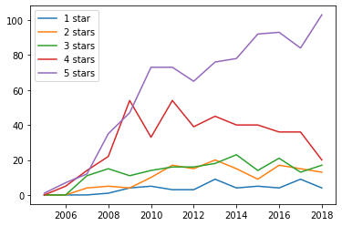
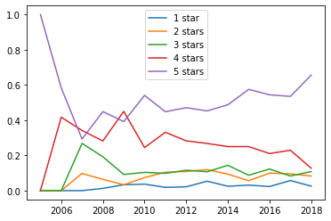

# Yelp Heatmap

This project consisted in using the Apache Spark library to demonstrate how it can handle the manipulation of high amounts of data. The dataset used was: https://www.kaggle.com/yelp-dataset/yelp-dataset . It is a subset of Yelp's businesses, reviews, and user data realating to businesses located across 11 metropolitan areas in four countries.

The [EntregaC.ipynb](./EntregaC.ipynb)  file contains the steps used to generate the following graphs with the Spark framework. The first image is the percentage of review scores of specific buisness over time, the second graph depicts the same data however normalized over the total reviews for that specific year, which gives us a more accurate accurate understanding of the rating's progression.

  - Reviews over time

  
  

  - Reviews over time normalized

  

The second part of the project was creating a heatmap with the user's reviews. To do that we first used Spark to get the average stars and std dev of each buisness in the database, then used the Yelp API to get the latitude and longitude of the buisnesss ([df_business_maker.ipynb](./df_business_maker.ipynb)), finally we saved that information on a SQL databse with the diagram bellow.
To create the heatmap itself we used the Google gmaps library for Python in the [EntregaBeA.ipynb](EntregaBeA.ipynb) there is an interactive cell that can generate the map based on an user's id showing they're reviews

- Database diagram

